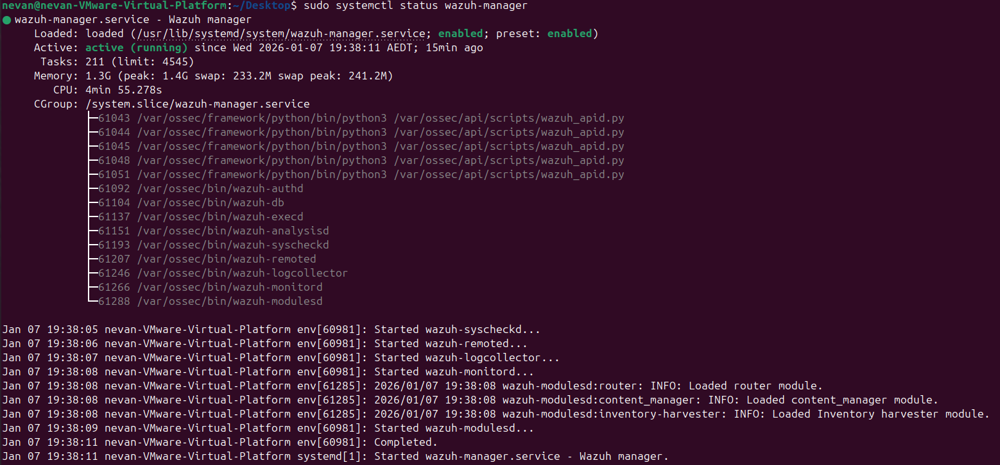
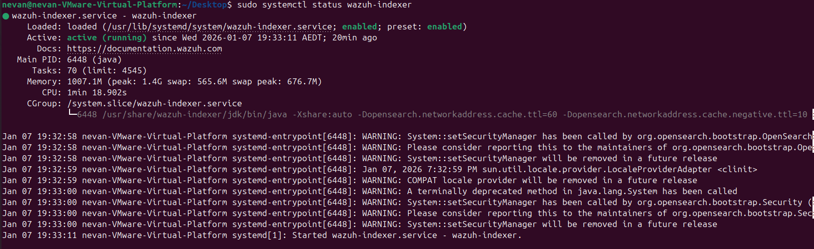
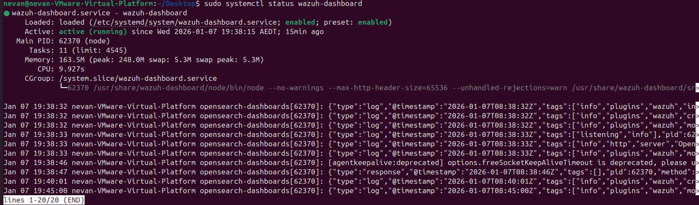

# Wazuh Setup (Lab)

This guide installs the Wazuh manager, indexer, and dashboard on a single Ubuntu VM using the official quickstart installer.
This setup is intended for learning and lab purposes, not production.

## Environment
- OS: Ubuntu (64-bit)
- Deployment: Single host (manager, indexer, dashboard on one VM)
- Hypervisor: VMware / VirtualBox / Hyper-V

## VM Requirements
- 2+ vCPU
- 4+ GB RAM (8 GB recommended if possible)
- 25+ GB disk
- Internet access

## Prerequisites
- Fresh Ubuntu VM
- sudo access
- curl installed
- No other package installations running (apt, Software Updater)

⚠️ On fresh Ubuntu installs, background updates may temporarily lock APT.  
If the installer fails, reboot and wait a few minutes before retrying.

## Install Wazuh (Single Host)
1) SSH into the Ubuntu VM.  
2) Download and run the installer:
```bash
curl -sO https://packages.wazuh.com/4.14/wazuh-install.sh
sudo bash ./wazuh-install.sh -a
```
3) When the installer finishes, note:
- Dashboard URL
- Generated admin password

4) Access the dashboard:
```
https://<VM-IP>
Username: admin
Password: shown at installer completion
```
Accept the self-signed certificate warning.

## Validation
Confirm all services are running:
```bash
sudo systemctl status wazuh-manager
sudo systemctl status wazuh-indexer
sudo systemctl status wazuh-dashboard
```
Expected result: `Active: active (running)`  
Successful login to the web dashboard confirms a valid installation.

### Service status examples







## Troubleshooting (Installer Issues)
**Check for APT / dpkg lock before running the installer**  
```bash
ps aux | grep -E "apt|dpkg"
```
If you see processes like `unattended-upgrades` or `apt.systemd.daily`, wait for them to finish or reboot the VM.

**Installer fails due to APT lock**  
If the installer reports `Another process is using APT`:
- `sudo reboot`
- After reboot, wait 2–3 minutes, then retry the installer.

**Clean up a failed or partial installation**  
If the installer fails mid-way or components are left in a broken state:
```bash
sudo systemctl stop wazuh-indexer wazuh-manager wazuh-dashboard 2>/dev/null
sudo apt remove --purge -y wazuh-* filebeat opensearch-dashboard opensearch
sudo rm -rf /var/lib/wazuh /var/ossec /etc/wazuh /usr/share/wazuh
sudo rm -rf /etc/opensearch /var/lib/opensearch
sudo apt autoremove -y
sudo apt --fix-broken install -y
```
Notes: package “not found” errors are expected if components never fully installed.

**“Wazuh indexer already installed” error**  
If the installer reports `ERROR: Wazuh indexer already installed`, force a clean overwrite:
```bash
sudo bash ./wazuh-install.sh -a -o
```
This removes existing Wazuh components and reinstalls everything.

**Verify service status after install/reinstall**  
```bash
sudo systemctl status wazuh-manager
sudo systemctl status wazuh-indexer
sudo systemctl status wazuh-dashboard
```
Expected: `Active: active (running)`. Successful dashboard login confirms a good install.

**Check installer logs**  
If installation fails again, inspect:
```bash
sudo less /var/log/wazuh-install.log
```

## Optional: VMware Guest Tools
If running on VMware:
```bash
sudo apt update
sudo apt install -y open-vm-tools open-vm-tools-desktop
sudo reboot
```

## Notes
- Ubuntu ISO: [ubuntu.com/download/desktop](https://ubuntu.com/download/desktop)
- Installer reference: [Wazuh Quickstart](https://documentation.wazuh.com/current/quickstart.html)
- Credentials and certificates are stored in the installer output bundle (`wazuh-install-files.tar`)
- This lab uses a single-node deployment for simplicity
- Production environments typically separate components

