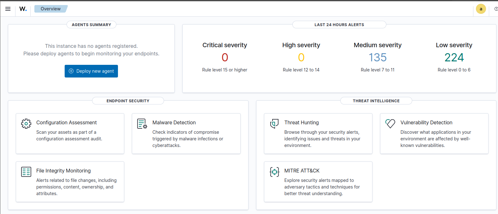

# Wazuh Setup (Lab)

how i set up wazuh on a single ubuntu vm (all-in-one: manager + indexer + dashboard). 

## My Setup
- ubuntu (64-bit)
- everything on one vm
- vmware (virtualbox / hyper-v should work too)

## What You'll Need
- 2+ vcpu
- 4+ gb ram (8gb recommended)
- 25+ gb disk


## Before You Start
- fresh ubuntu vm
- sudo access
- curl installed
- make sure apt isn't doing updates in the background

heads up: fresh ubuntu sometimes has background updates that lock apt. if install fails, reboot + wait a bit + retry.

## Installing Wazuh

1. ssh into your ubuntu vm

2. download + run installer:
```bash
curl -sO https://packages.wazuh.com/4.14/wazuh-install.sh
sudo bash ./wazuh-install.sh -a
```

what it does:
- `curl -sO` downloads the installer script
- `-a` = all-in-one install (manager + indexer + dashboard)

3. when it finishes, save:
- dashboard url
- generated admin password

4. open dashboard:
- get vm ip:
```bash
ip a
```
- go to:
```
https://<VM-IP>
```
- login: `admin` + the password from installer
- self-signed cert warning is normal for lab, just accept



## Making Sure Everything Works

check services:
```bash
sudo systemctl status wazuh-manager
sudo systemctl status wazuh-indexer
sudo systemctl status wazuh-dashboard
```

what to look for: `Active: active (running)` on all 3. if u can login to dashboard, ur good.

### Service status examples


## Changing the Default Password

after u confirm login works, change admin password:
```bash
sudo /usr/share/wazuh-indexer/plugins/opensearch-security/tools/wazuh-passwords-tool.sh \
  -u admin -p '<your_password>'
sudo systemctl restart wazuh-dashboard
```
then login again with the new password.

## Troubleshooting

check if apt/dpkg is locked:
```bash
ps aux | grep -E "apt|dpkg"
```
if u see stuff like `unattended-upgrades` / `apt.systemd.daily`, wait or reboot.

installer fails w/ apt lock (`Another process is using APT`):
- Run `sudo reboot`
- After it comes back up, wait 2–3 minutes, then try the installer again

clean up if install got messed up:
```bash
sudo systemctl stop wazuh-indexer wazuh-manager wazuh-dashboard 2>/dev/null
sudo apt remove --purge -y wazuh-* filebeat opensearch-dashboard opensearch
sudo rm -rf /var/lib/wazuh /var/ossec /etc/wazuh /usr/share/wazuh
sudo rm -rf /etc/opensearch /var/lib/opensearch
sudo apt autoremove -y
sudo apt --fix-broken install -y
```
notes: “package not found” errors are fine if something never fully installed.

if u get `ERROR: Wazuh indexer already installed`, run overwrite:
```bash
sudo bash ./wazuh-install.sh -a -o
```
`-o` = overwrite (wipe existing wazuh + reinstall).

check services after install/reinstall:
```bash
sudo systemctl status wazuh-manager
sudo systemctl status wazuh-indexer
sudo systemctl status wazuh-dashboard
```

check installer logs:
```bash
sudo less /var/log/wazuh-install.log
```

## Optional: VMware Guest Tools

if ur on vmware, guest tools can help:
```bash
sudo apt update
sudo apt install -y open-vm-tools open-vm-tools-desktop
sudo reboot
```

## Notes
- ubuntu iso: [ubuntu.com/download/desktop](https://ubuntu.com/download/desktop)
- wazuh quickstart: [Wazuh Quickstart](https://documentation.wazuh.com/current/quickstart.html)
- installer saves creds/certs in `wazuh-install-files.tar`
