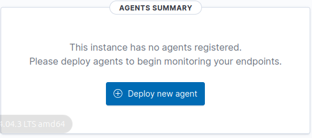
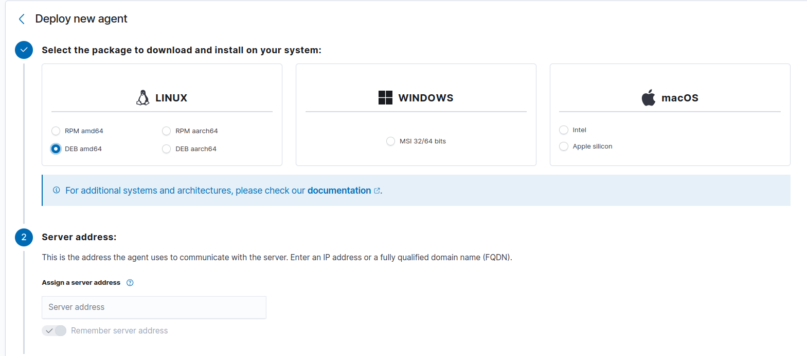
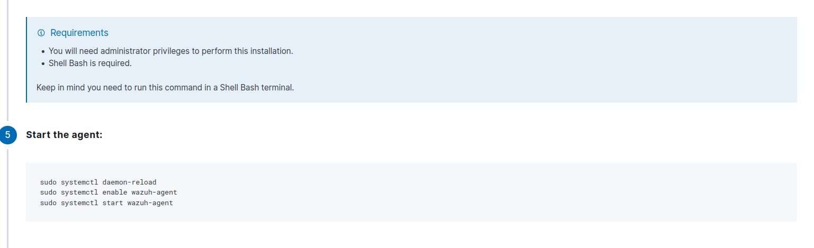
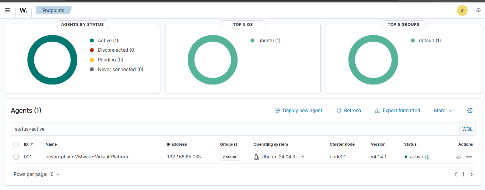

## Adding a Wazuh Agent (Endpoint)

This is how I set up and enrolled a Wazuh agent in my lab. The agent runs on a separate Ubuntu VM and sends data back to the Wazuh manager so I can monitor it.

Make sure you've already got the Wazuh manager, indexer, and dashboard running (see `01-setup.md`) before you start this.

## How It Works

Wazuh uses a manager–agent setup.

### Manager (Already Running)

The manager does the heavy lifting:
- Receives logs and events from agents
- Runs detection rules and correlation
- Stores everything in the indexer
- Serves up the dashboard

### Agent (What We're Adding)

The agent is a lightweight thing that runs on endpoints:
- Collects system logs and security events
- Does file integrity monitoring (FIM)
- Sends data securely to the manager
- Shows up as a registered endpoint in the dashboard

⚠️ **Important**  
You need to install the agent on a **separate VM**. Installing it on the manager VM doesn't make sense - you can't monitor the thing that's doing the monitoring!

## What You'll Need

### Virtual Machines

- **1 × Wazuh Manager VM** (from `01-setup.md`)
- **1 × Agent (Client) VM**
  Ubuntu Server or Desktop works fine

### Hardware Notes

**Manager VM**
- Minimum: **4 GB RAM** (but it's pretty unstable at this)
- Recommended: **8 GB RAM** - this makes startup and agent enrollment much more reliable

**Agent VM**
- **1–2 GB RAM** is plenty

### Network

- Both VMs need to be able to talk to each other
- Same NAT or host-only network is fine
- IP addresses work - you don't need DNS

### Firewall Setup (Manager VM)

If you have UFW enabled on the manager, you need to open these ports before agents can enroll:

```bash
# Agent enrollment
sudo ufw allow 1515/tcp

# Agent communication
sudo ufw allow 1514/tcp
sudo ufw allow 1514/udp

sudo ufw reload
```

Without TCP/1515, agents will fail to enroll even if everything else is running.

**What these ports do:**
- **1515/tcp**: Used for **agent enrollment** - this is where `agent-auth` connects. If this is blocked, new agents can't register.
- **1514/tcp** and **1514/udp**: Used for **log/telemetry traffic** from agents to the manager.
- **`sudo ufw reload`**: Applies the new firewall rules without rebooting.

## What You'll See in the Dashboard

### Before Adding an Agent

When you don't have any agents yet, the **Endpoints** page will be empty and show a prompt to deploy one.

### After Enrollment

Once an agent connects successfully, it shows up as **Active** with OS, IP, and version info populated.

## Deploying the Agent (Using the Dashboard)

The Wazuh Dashboard has a nice guided workflow that generates the right installation commands for your agent's OS.

Just to be clear: the dashboard doesn't install the agent for you. You still need to run all the commands on the **agent VM**.

### Step 1: Start Agent Deployment

- Open the Wazuh Dashboard
- Go to **Endpoints**
- Click **Deploy new agent**



### Step 2: Pick Your Platform

Choose the operating system and architecture of your agent VM.

For Ubuntu labs:
- Select **Linux**
- Select **DEB amd64**

The dashboard will customize the commands based on what you pick.



### Step 3: Enter Agent Name and Server Address

In the dashboard, enter:
- **Agent name**: Something descriptive (like `ubuntu-client-01`)
- **Server address**: The Wazuh manager IP address
  - Use the private IP (like `192.168.65.x`)
  - You don't need an FQDN for labs

This address is what the agent uses to talk to the manager.

### Step 4: Install the Agent (On the Agent VM)

The dashboard will show you installation commands. Run these on the **agent VM**:

Download the agent package:

```bash
wget https://packages.wazuh.com/4.x/apt/pool/main/w/wazuh-agent/wazuh-agent_4.14.1-1_amd64.deb
```

Install and register the agent (replace `YOUR_MANAGER_IP` with your manager IP):

```bash
sudo WAZUH_MANAGER="YOUR_MANAGER_IP" \
     WAZUH_AGENT_NAME="ubuntu-client-01" \
     dpkg -i wazuh-agent_4.14.1-1_amd64.deb
```

**What these parameters do:**
- **`WAZUH_MANAGER`**: The IP address or hostname of your **Wazuh manager**
  - In a lab, this is usually the private IP of your Wazuh VM (like `192.168.65.x`)
- **`WAZUH_AGENT_NAME`**: The **name** this endpoint will have in the dashboard and CLI (like `ubuntu-client-01`)
  - You can make this whatever you want - `web01`, `win10-lab`, etc.
- **`dpkg -i`**: Installs the downloaded `.deb` package on Ubuntu/Debian

### Step 5: Start the Agent Service

After installation, enable and start the agent:

```bash
sudo systemctl daemon-reload
sudo systemctl enable wazuh-agent
sudo systemctl start wazuh-agent
```

Check that it's running:

```bash
sudo systemctl status wazuh-agent
```



## Agent Enrollment (You Have to Do This!)

Just installing the agent package isn't enough. Each agent needs to authenticate with the manager.

Run this on the **agent VM**:

```bash
sudo /var/ossec/bin/agent-auth -m YOUR_MANAGER_IP
```

**What this does:**
- **`/var/ossec/bin/agent-auth`**: The Wazuh **agent enrollment client**
- **`-m YOUR_MANAGER_IP`**: The `-m` option tells the agent which **manager IP** to contact for registration
  - This needs to match the IP you used in `WAZUH_MANAGER` and in the dashboard server address

You should see:

```text
INFO: Authorization successful.
```

Then restart the agent:

```bash
sudo systemctl restart wazuh-agent
```

## Making Sure It Worked

### On the Manager VM

List all registered agents:

```bash
sudo /var/ossec/bin/agent_control -lc
```

**What this does:**
- **`agent_control`**: Manager-side tool to **query and control agents**
- **`-l`**: List all agents the manager knows about
- **`-c`**: Include **connection status** (active, never connected, disconnected, etc.) in the output

You should see something like:

```text
ID: 001, Name: ubuntu-client-01, Active
```

### In the Dashboard

- Go to **Endpoints**
- Check that the agent status is **Active**

The agent should now show up in the dashboard with status **Active**, displaying OS, IP address, and version info.



## Common Issues

- **Agent service running ≠ agent enrolled** - Just because the service is running doesn't mean it's enrolled!
- **UFW silently blocking TCP/1515** - This is a sneaky one, make sure that port is open
- **Manager running on low RAM delaying enrollment** - If your manager only has 4 GB, enrollment can take a while or fail

If the agent doesn't show up:

- Make sure manager services are running
- Check that port **1515** is listening
- Look at the agent logs:

```bash
sudo tail -f /var/ossec/logs/ossec.log
```
