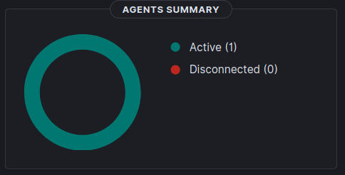
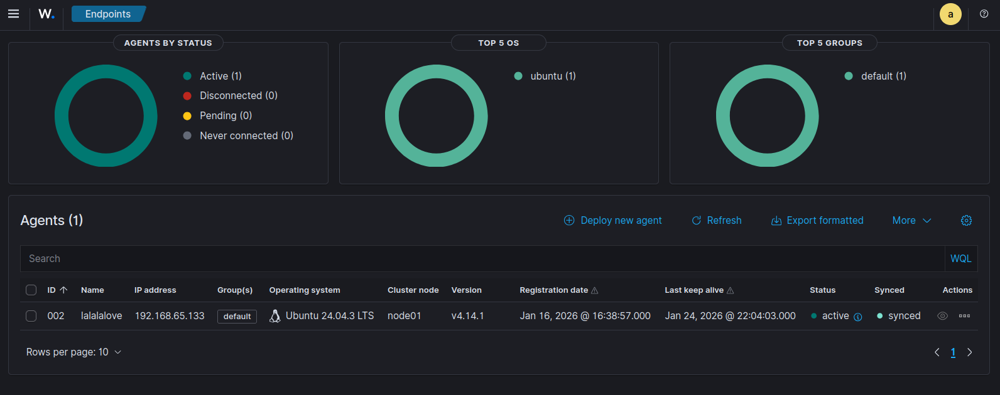
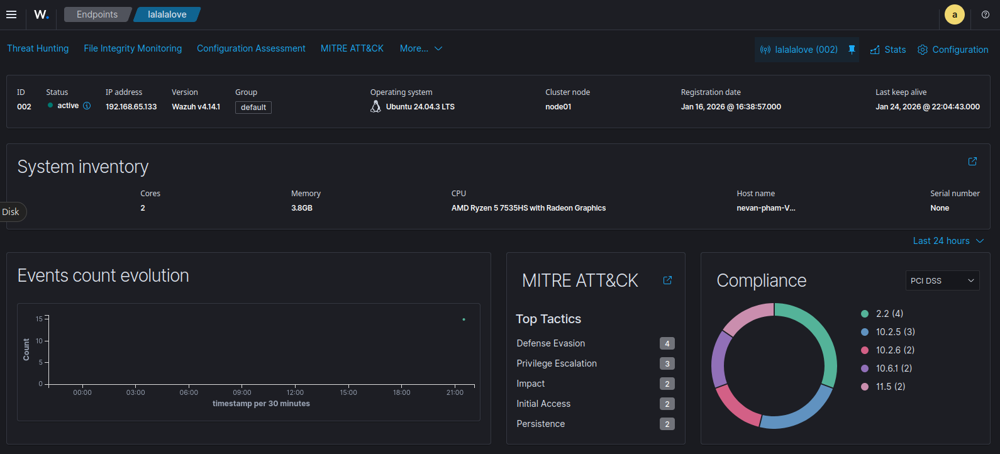
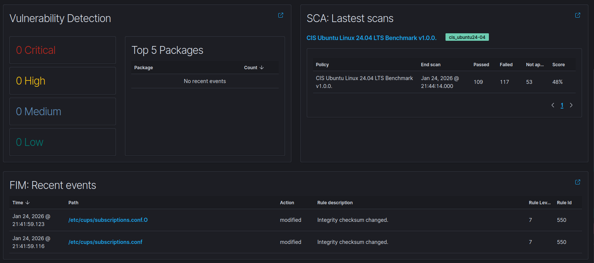
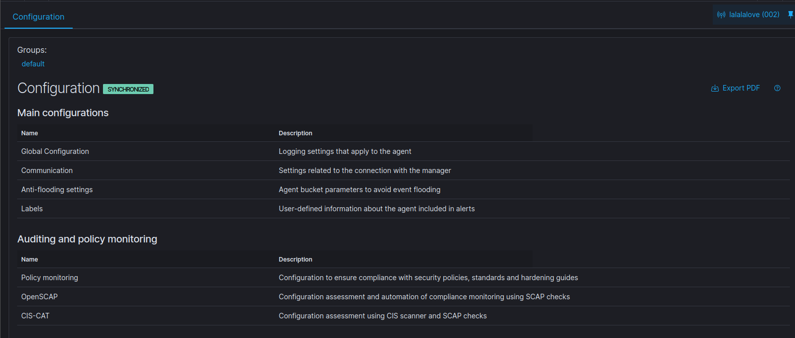

# Wazuh Dashboard – Overview

quick overview of the Overview page in the wazuh dashboard. shows summary of agents and recent alerts. good way to check everything is working.

---

## Agents Summary

### What it is

agents summary panel shows connection status of all enrolled agents.

agents grouped by status:
- Active
- Disconnected
- Pending
- Never connected

tells you if endpoints are visible and talking to manager. just connectivity stuff, not about threats or alerts beyond connection status.

---

### Agent Details 

click on an agent from the summary panel to see detailed view with current state, activity level, and security context for that endpoint.

---

#### Agent Identity and Status

basic info about agent and health status.

includes:
- agent id and name - how wazuh identifies it
- status - if agent is currently active
- ip address - where endpoint is on network
- agent version - what version installed
- operating system - os and version reported
- group - which agent group (determines config applied)
- cluster node - which manager node handling it
- registration date - when enrolled
- last keep-alive - when last checked in

confirms agent is properly enrolled, actively communicating, sending up-to-date data. basically tells you if you can trust the data below.

---

#### System Inventory

shows basic hardware and host info agent collected.

usually includes:
- cpu model and cores
- available memory
- hostname
- serial number (often missing for vms)

gives context about endpoint without external inventory system.

in lab: low resource values and missing serial numbers normal for vms. fact that data is here means inventory collection is working.

---

#### Events Count Evolution

graph showing how many events agent generated over time.

shows overall activity level, highlights sudden spikes or weird increases.

in lab: mostly flat or low-activity graph normal in quiet lab.

---

#### MITRE ATT&CK

shows how alerts from agent map to MITRE ATT&CK tactics.

categorizes detection rules into high-level adversary behavior classes. gives context on what types of behaviors rules are catching.

in lab: seeing tactics like defense evasion or privilege escalation pretty common, usually nothing to worry about.

---

#### Compliance

maps alerts and checks to compliance frameworks like PCI DSS.

shows which compliance control categories associated with what you're seeing. helps with compliance visibility and reporting.

in lab: charts with data expected, doesn't mean non-compliant or at risk.

---

#### Vulnerability Detection

shows known vulnerabilities found on agent based on installed packages.

includes:
- counts grouped by severity (critical, high, medium, low)
- list of most frequently affected packages if any

shows known software vulnerabilities affecting endpoint. confirms vulnerability scanning enabled and running.

note: detected vulnerabilities mean potential exposure, not exploitation. no findings doesn't mean system is secure.

in lab: zero or low findings common in fresh lab systems, don't expect real-world exposure levels.

---

#### Security Configuration Assessment (SCA)

shows results from recent configuration assessments against security benchmarks.

includes:
- benchmark or policy used (like CIS Ubuntu Linux Benchmark)
- when last scan completed
- number of passed, failed, not applicable checks
- overall compliance score

evaluates system config against hardening guidelines. gives baseline view of security posture.

note: low scores super common on default installations. doesn't mean misconfigured or compromised.

in lab: failing checks totally expected unless system explicitly hardened.

---

#### File Integrity Monitoring (FIM)

shows recent file integrity events detected on agent.

includes:
- when event happened
- file path affected
- action performed (like modified)
- rule description and severity level

tracks changes to monitored files and directories. gives visibility into filesystem activity.

in lab: seeing integrity events normal, confirms FIM is working.

---

### Agent Configurations

When you are in the Agent Details page, to view Agent Configurations, click on the top left of that page. This shows which security and monitoring features are enabled and managed for this agent.

---

#### Configuration Status and Groups

Top of the page, display which group is the agent in (default) and synchronization status indicating whether the agent is using the latest configuration.

---

#### Main Configurations

Contain core agent behaviour and communication settings.

Includes:
 - Global Configuration: Logging and general agent behavior
 - Communication: How the agent connects to the Wazuh manager
 - Anti-flooding settings: Controls to prevent event flooding
 - Labels: Custom metadata added to agent alerts

---
#### Auditing and Policy Monitoring

controls features related to configuration compliance and system hardening.

Includes:
 - Policy monitoring: Security policy and baseline checks

 - OpenSCAP: Automated compliance checks using SCAP standards. Security Content Automation Protocol (SCAP) is a National Institute of Standards and Technology (NIST) framework of interoperable specifications that standardizes the format of security data to automate vulnerability management, configuration assessment, and policy compliance.

 - CIS-CAT (Center for Internet Security – Configuration Assessment Tool): CIS benchmark scanning. Checks an operating system or application's configuration and compares it against CIS security hardening benchmarks. E.g.: Does this system follow recommended security hardening settings?
---
#### System Threads and Incident Response

lists modules related to advanced detection and response capabilities.

includes:
 - Osquery: Query-based system inspection
 - Inventory data: Collection of system and package metadata
 - Active response: Automated response actions
 - Commands: Remote command execution framework
 - Docker listener: Monitoring Docker container activity

notes: Defines what advanced telemetry and response actions the agent is capable of performing. Not very important rn.

---
#### Log data analysis

controls how logs and file changes are monitored. Probably very important.

includes:
 - Log collection: Ingesting logs from files, syslog, or Windows events
 - Integrity monitoring: File Integrity Monitoring (FIM)

Notes: threat detection and alert for events

---
#### Cloud security monitoring

contains cloud stuff and external services

includes: 
 - Amazon S3: monitor logs from aws services
 - Google Cloud Pub/Sub: logs from google cloud services
 - Github: repos events and permission changes and sus activity

notes: 
 - agent can be extended to monitor cloud and SaaS service
 - probably not for me atm cause im too poor to do any cloud services, github maybe but we will see

## Last 24 Hours Alerts

### What it is

last 24 hours alerts panel shows how many alerts wazuh generated in last 24 hours.

alerts broken down by:
- time
- severity level

quick look at recent alert activity, helps spot sudden increases or weird patterns in alert volume.

keep in mind - these are signals generated by detection rules, not confirmed security incidents.

logs and events happened last 24 hours (or within the period you want, so basically you can adjust this, like choosing a period or a specific date)

you can save and export these logs out

you can also filter them based on the fields

currently im just setting up one agent without doing anything so there will be no abnormal logs (i guess?)