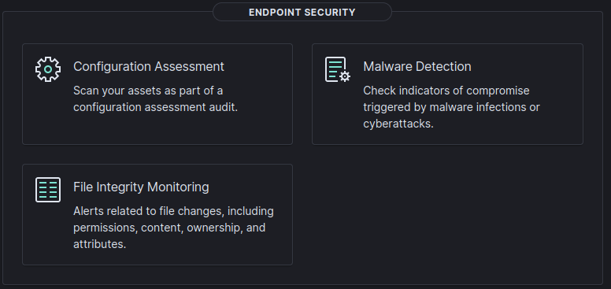

# Endpoint Security - Overview

Check for endpoint's security baseline and guidelines and see if everything is up to standard. We can scan and check for IOCs, and alerts related to FIM. 

---

## Configuration Assessment

## Malware Detection

## File Integrity Monitoring

