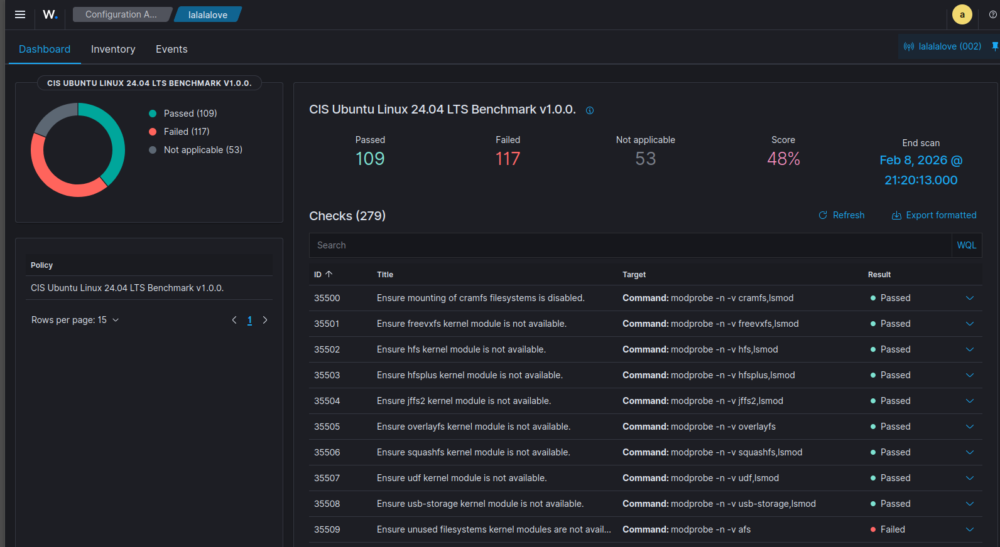

# Endpoint Security - Overview

Check for endpoint's security baseline and guidelines and see if everything is up to standard. We can scan and check for IOCs, and alerts related to FIM. 

---

## Configuration Assessment

sca just scan to verify if the agents have any weaknesses and reduce the attack surface

There will be 3 options on the top left when u are in this page:

### Dashboard

When u get into this page, u have an option to choose which agent will you scan. After choosing and scanning the agent using the CIS benchmark, it will return a dashboard like this:

Apparently the default given Ubuntu when i downloaded from the official page failed over 50% of the check.

from my research, it looks like CIS benchmarks are hardening standards, so its basically asking “Is this system hardened for a production, security-sensitive environment?” So therfore technically the VM is not insecured or anything like that.

You can click into each ID to see the rationale and desc on why its failing and what to fix.

### Inventory

### Events

## Malware Detection

## File Integrity Monitoring

